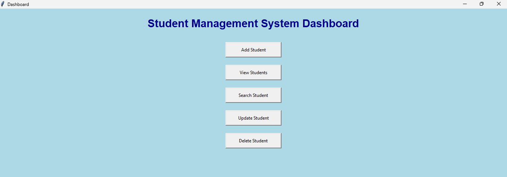
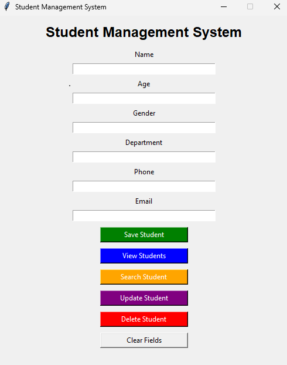
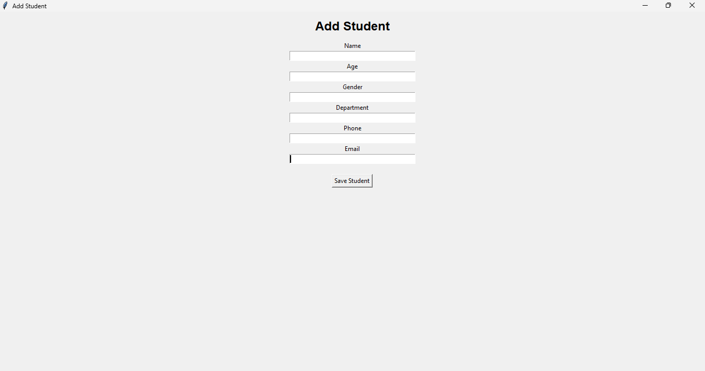
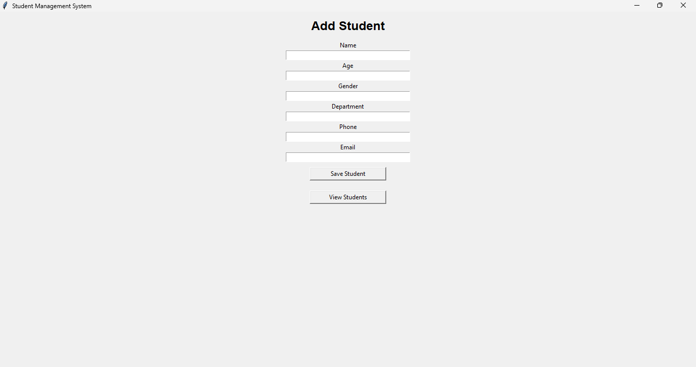

# Student Management System

A simple Student Management System developed using Python, Tkinter, and SQLite. This application helps manage student records efficiently through a graphical user interface.

## Features

- User Login System
- Add Student Records
- View Student Details
- Save Student Information
- Dashboard Interface
- SQLite Database Integration
- Simple and User-Friendly GUI

## Technologies Used

- Python
- Tkinter
- SQLite3
- VS Code

## Project Structure

```
StudentManagementSystem/
│
├── assets/
├── database/
│   └── student.db
├── screenshot/
│   ├── login.png
│   ├── dashboard.png
│   ├── student_management.png
│   ├── save.png
│   └── view.png
│
├── login.py
├── dashboard.py
├── database.py
├── student.py
├── main.py
├── requirements.txt
└── README.md
```

## Screenshots

### Login Page


### Dashboard


### Student Management


### Save Student


### View Students


## Installation

1. Clone the repository

```bash
git clone https://github.com/dharshinibala22/Student-Management-System.git
```

2. Navigate to project folder

```bash
cd StudentManagementSystem
```

3. Install required packages

```bash
pip install -r requirements.txt
```

4. Run the application

```bash
python main.py
```

## Database

The project uses SQLite database (`student.db`) to store and manage student information.

## Future Enhancements

- Update Student Records
- Delete Student Records
- Search Functionality
- Export Data to Excel
- Improved User Interface

## Author

Dharshini Balasubramaniyan
